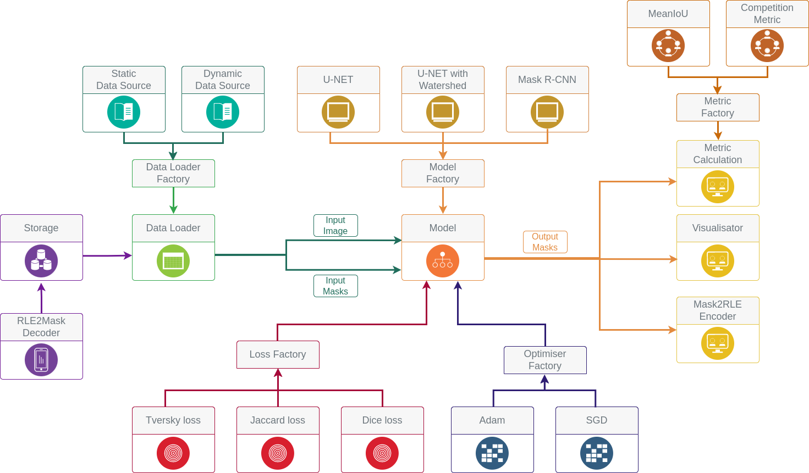
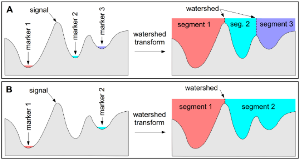

## Sartorius - Cell Instance Segmentation competition project

### About

Our project is based on the problem of instance segmentation of neurons in medical images in [this](https://www.kaggle.com/c/sartorius-cell-instance-segmentation)
 Kaggle competition. Methods for treating neurological pathologies, such as Alzheimer's disease, are currently being developed. One way to monitor how effective the treatment is is to examine the neurons with light microscopy. However, at present, the task of segmenting individual neurons in images obtained from microscopy is complex and time-consuming. Therefore, the implementation of solutions based on computer vision can accelerate this process.
 
### Usage

```
kaggle competitions download -c sartorius-cell-instance-segmentation  # download data from kaggle
pip install -r requirements.txt
python3 main.py -c <CONFIG_PATH>
```

### Architecture

This project implements a pipeline with multiple models support, options to train model, use pretrained, create predictions and visualise them.



To choose different types of pipeline components and set different parameters for them use config file, located in `configs` folder.

#### Data

As input data we have light microscopy images:


and also masks enconed in csv file by RLE encoding.

#### Data loader

2 available data loaders:

- Dynamic - will load images and masks on the demand - less memory usage, but slower
- Static - will preload all data - quicker, but bigger memory usage

Can be specified by "generator_type" field in config.

#### Models

3 available models:

- The first approach used in our work was U-Net. It is a convolutional network developed by the University of Freiburg. In general, its architecture can be described as follows. The network consists of two parts: descending and ascending. First, the image through several blocks of the usual 3 by 3 convolutions and MaxPool layers, gradually reducing its dimension, but increasing the number of channels (the left part of the image below). Then, in the right part, there is a reverse process, where "up-convolution" reduces the number of channels and increases the dimension.


TO train model, set "use_pretrained" field in config to false, to use pretrained, set it to true.

- The second approach we are considering is Deep Watershed Transformation. This method works as follows. The basic idea is to spread the image as a "mountain massif", where the height is the intensity of pixels, place markers "water sources" and fill the "pools" formed by mountain massifs with water. However, in the classical approach, it is difficult to identify the boundaries of watersheds and points of water sources. That's why CNN (for example, U-Net) is coming to the rescue. It helps us to obtain the following data: a basic binary mask, several masks with different levels of erosion - to better define the boundaries of watersheds, cell centers - for use as a source of water.




- Another interesting approach (and now state of the art for these tasks) is to use Mask R-CNN. It consists of two stages. The first contains 2 parts - the convolutional network and the Region Proposal Network (RPN) - which from the exit of the convolutional network forms a set of regions of interest that contain objects. Then begins the second stage, which uses fully connected layers to determine the class and bounding of the object in the region, as well as an additional convolutional part that generates a mask for the object.


Model type can be specified by "model_name" field, also can be specified different params for model, like num of epochs, train ratio (ratio of train/test split), metrics to use and other.

#### Losses

Can be used different loss functions: Jaccard, Tversky, Dice losses.

Can be specified by "loss_function" field in config, also use "loss_params" field to specify loss function hyperparameters.

#### Output modules

- Visualiser. Visualises prediction from train dataset. Will show input image, desirable mask and predicted one. To enable - set "display" field in config to true.


- RLE submission encoder. Will encode competition test predictions back to RLE for competition submission. To enable - set "predict_submission" field in config to true.

- Competition metric. Will calculate competition metric for test dataset. To enable - set "calc_metrics" field in config to true.


#### Metrics:

Available 2 metrics:

- MeanIoU - basic Mean Intersection over Union
- competition_metric - competition-specific metric, based on MeanIoU with different threshold levels. More details [here](https://www.kaggle.com/c/sartorius-cell-instance-segmentation/overview/evaluation).

To set metrics to use during training, add their names into "metrics" config field.

### Achieved results
